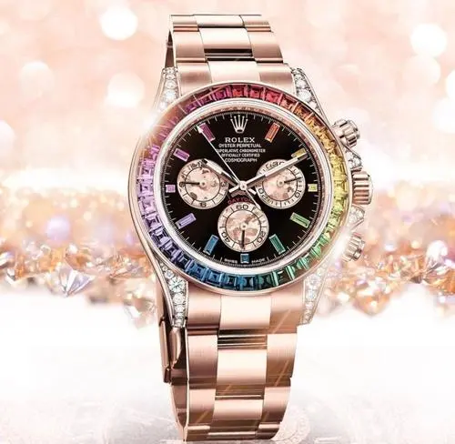

<!---
lingfengxh/lingfengxh is a ✨ special ✨ repository because its `README.md` (this file) appears on your GitHub profile.
You can click the Preview link to take a look at your changes.
--->
<!DOCTYPE html>
<html lang="en">
<head>
    <meta charset="UTF-8">
    <title>品优购-正品低价、品质保障、配送及时、轻松购物！</title>
    <meta name="description"
          content="品优购-专业的综合网上购物商城，为您提供正品低价的购物选择、优质便捷的服务体验。商品来自全球数十万品牌商家，囊括家电、手机、电脑、
          服装、居家、母婴、美妆、个护、食品、生鲜等丰富品类，满足各种购物需求。"/>
    <meta name="Keywords" content="网上购物,网上商城,家电,手机,电脑,服装,居家,母婴,美妆,个护,食品,生鲜,品优购"/>
    <link rel="shortcut icon" href="favicon1.ico"  type="image/x-icon"/>
    

    <link rel="stylesheet" href="css/初始化.css">
    <link rel="stylesheet" href="css/base.css">
    <link rel="stylesheet" href="css/common.css">

</head>
<body>
    
<!--    头部标签，欢迎、注册与登录使用子绝父相，标签栏使用行内块元素里面嵌套行内块元素，-->
    <header>
        
品优购欢迎您！

        <a class="sign" href="#">请登录</a>
        <a class="register" href="register.html">免费注册</a>

<!-- 改进——每个竖线都由一个li来表示-->
        <ul class="navigation">
            <li class="label">
                <a href="#">我的订单</a>
            </li>
            <i class="line"></i>

            <li class="label">
                <a class="t" href="#">我的品优购 <em class="inside"></em>
</a>
            </li>
            <i class="line"></i>

            <li class="label">
                <a href="#">品优购会员</a>
            </li>
            <i class="line"></i>

            <li class="label">
                <a href="#">企业采购</a>
            </li>
            <i class="line"></i>

            <li class="label1">
                <a href="#">关注品优购</a> 
            </li>
            <i class="line"></i>

            <li class="label1">
                <a href="#">客户服务</a>  
            </li>
            <i class="line"></i>

            <li class="label1">
                <a href="#">网站导航</a>  
            </li>
        </ul>
    </header>

<!--    nav标签，图片标签使用子绝父相， 搜索框、优惠框使用行内块元素， 购物车使用子绝父相，里面的元素浮动 商品分类标签使用子绝父相，
        购物标签使用子绝父相。-->
    <nav>
        

        
            <input class="written" type="text" placeholder="9块9带回家！">
            <a class="jump" href="listPage.html">搜索</a>
        

<!--改进——不用ul，li标签，直接div+a标签制作-->
        <ul class="discount">
            <li class="element1"><a href="#">优惠购首发</a></li>
            <li class="element"><a href="#">亿元优惠</a></li>
            <li class="element"><a href="#">9.9元团购</a></li>
            <li class="element"><a href="#">每满99减30</a></li>
            <li class="element"><a href="#">办公用品</a></li>
            <li class="element"><a href="#">电脑</a></li>
            <li class="element"><a href="#">通信</a></li>
        </ul>

<!--改进——前购物车后右括号直接用before、after伪元素选择器。 数字8（不考虑字体图标）再使用一个盒子，考虑定位-->
        <a href="#">
            <i class="cart">
                <em style="float: left; font-size: 20px;color: #d19089;margin-left: 24px;line-height: 50px;"></em>
                <em style="float: left; font-size: 14.5px; margin: 14px 0 0 5px; color: #666;">我的购物车</em>
                <em style="float: left; font-size: 24px; "></em>
                <em style="float: left; font-size: 16px; margin-top: 15px;"></em>
            </i>
        </a>

        

            全部商品分类
            <ul class="shopping">
                <li class="kind" style="color:#c81686; margin: 15px 0 0 30px;"><a href="#">服装城</a></li>
                <li class="kind"><a href="#">美妆馆</a></li>
                <li class="kind"><a href="#">传智超市</a></li>
                <li class="kind"><a href="#">全球购</a></li>
                <li class="kind"><a href="#">闪购</a></li>
                <li class="kind"><a href="#">团购</a></li>
                <li class="kind"><a href="#">拍卖</a></li>
                <li class="kind"><a href="#">有趣</a></li>
            </ul>
        

    </nav>

<!--    div盒子嵌套三部分，section元素浮动，再嵌套一个盒子，让里面的元素一部分使用子绝父相，一部分直接行内块元素
        图片部分，先使用行内块元素固定一个位置，再嵌套一个盒子，让里面的各个元素可以使用子绝父相。
        快报部分，先使用行内块元素固定一个位置，再对里面分成四块浮动的盒子，浮动里面再放入行内块元素
-->
    

    <section>
        <ul class="electric" style="display: inline-block; width: 260px; height: 600px;">
            <li class="furniture"><a href="#">家用电器</a><i class="hide"></i></li>
            <li class="furniture"><a href="#">手机 数码 通信</a></li>
            <li class="furniture"><a href="#">电脑 办公</a></li>
            <li class="furniture"><a href="#">家居 家具 家装 厨具</a></li>
            <li class="furniture"><a href="#">男装 女装 童装 内衣</a></li>
            <li class="furniture"><a href="#">个人化妆 清洁用品 宠物</a></li>
            <li class="furniture"><a href="#">鞋靴 箱包 珠宝 奢侈品</a></li>
            <li class="furniture"><a href="#">运动户外 钟表</a></li>
            <li class="furniture"><a href="#">汽车 汽车用品</a></li>
            <li class="furniture"><a href="#">母婴 玩具乐器</a></li>
            <li class="furniture"><a href="#">食品 酒类 生鲜 特产</a></li>
            <li class="furniture"><a href="#">医药保健</a></li>
            <li class="furniture"><a href="#">图书 音像 电子书</a></li>
            <li class="furniture"><a href="#">彩票 旅行 充值 票务</a></li>
            <li class="furniture"><a href="#">理财 众筹 白条 保险</a></li>
        </ul>
    </section>

    
            

                
                <a href="#"><i class="direction1">    </i> </a>
                <a href="#"><i class="direction2">    </i> </a>
                <ul class="box">
                    <li class="circular"></li>
                    <li style="background-color: #fff;" class="circular"></li>
                    <li class="circular"></li>
                    <li class="circular"></li>
                    <li class="circular"></li>
                    <li class="circular"></li>
                </ul>
            

    

    
        <em class="express">
            <strong class="fast">品优购快报</strong>
            <a href="#">更多 </a>
        </em>
        <ul class="preferential">
            <li class="especially"><a href="#"><strong>[特惠]</strong><i>备战开学季全民半价购数码</i></a></li>
            <li class="especially"><a href="#"><strong>[公告]</strong><i>品优稳占家电网购六成分额</i></a></li>
            <li class="especially"><a href="#"><strong>[特惠]</strong><i>百元中秋全品类礼卷限里领</i></a></li>
            <li class="especially"><a href="#"><strong>[公告]</strong><i>上品优生鲜享阳澄胡大闸蟹</i></a></li>
            <li class="especially"><a href="#"><strong>[特惠]</strong><i>每日享折扣品优品质游</i></a></li>
        </ul>
        <ul class="charges">
            <a href="#"><li class="telephone"><i>话费</i></li></a>
            <a href="#"><li class="telephone"><i>机票</i></li></a>
            <a href="#"><li class="telephone"><i>电影票</i></li></a>
            <a href="#"><li class="telephone"><i>游戏</i></li></a>
            <a href="#"><li class="telephone"><i>彩票</i></li></a>
            <a href="#"><li class="telephone"><i>加油卡</i></li></a>
            <a href="#"><li class="telephone"><i>酒店</i></li></a>
            <a href="#"><li class="telephone"><i>火车票</i></li></a>
            <a href="#"><li class="telephone"><i>众筹</i></li></a>
            <a href="#"><li class="telephone"><i>理财</i></li></a>
            <a href="#"><li class="telephone"><i>礼品卡</i></li></a>
            <a href="#"><li class="telephone"><i>白条</i></li></a>
        </ul>
        
    
    

<!--    一个块级盒子里面放两个浮动的盒子，第二个浮动的盒子里面放4个行内块元素，每个行内块元素里面再放2个行内块元素-->
    

        
            <i></i>
            <em>今日推荐</em>
        
        <ul class="merchandise">
            <a href="#">
                <li class="label3">
                    <em>优质好货</em> <i>满300减100</i> <strong>满500减200</strong>
                    
                </li>
            </a>

            <a href="#">
                <li class="label3">
                    
                        <em>平牌甩货</em> <i style="background-color: #67b300">满300减100</i> <strong>团购低至9.9</strong>
                        <ins>团购</ins>
                    
                    
                </li>
            </a>

            <a href="#">
                <li class="label3">
                    
                        <em>时尚穿搭</em> <i style="background-color: #ed132b">低至3.6折</i> <strong>暑假出游季</strong>
                        <ins style="background-color: #e2162f">闪购</ins>
                    
                    
                </li>
            </a>

            <a href="#">
                <li class="label3">
                    
                        <em>0点上新</em> <i style="background-color: #0083fe">全场包邮</i> <strong>低至1折</strong>
                        <ins style="background-color: #0085fb">闪购</ins>
                    
                    
                </li>
            </a>
        </ul>
    

<!--两个行内块元素开头
    一个块级元素里面放6个行内块元素，每个行内块元素里面的标签都进行浮动-->
    <h1>猜你喜欢</h1>       <a href="##"><i class="change">换一批</i></a>
    <ul class="guess">
        <a href="#">
            <li class="like">
                
                
                    <i>阳关美包新款单肩包女</i>
                    <strong>时尚子母包四件套女包</strong>
                    <em>￥116.00</em>
                
            </li>
        </a>
        <a href="#">
            <li class="like">
                
                
                    <i>爱仕达 30CM炒锅不沾</i>
                    <strong>锅NWG8330E电磁炉炒</strong>
                    <em>99.00</em>
                
            </li>
        </a>
        <a href="#">
            <li class="like">
                
                
                    <i>捷波朗</i>
                    <strong>（jabra）BOOSI劲步</strong>
                    <em>￥245.00</em>
                
            </li>
        </a>
        <a href="#">
            <li class="like">
                
                
                    <i>欧普</i>
                    <strong>JYLZ08面板灯平板灯铝</strong>
                    <em>￥238.00</em>
                
            </li>
        </a>
        <a href="#">
            <li class="like">
                
                
                    <i>小米</i>
                    <strong>（G5500）移动联</strong>
                    <em>￥6649.00</em>
                
            </li>
        </a>
        <a href="#">
            <li class="like">
                
                    <i>韩国所望</i>
                    <strong>紧致湿润精华露400ml</strong>
                    <em>￥649.00</em>
            </li>
        </a>
    </ul>

<!--    使用一个大盒子，再分成四个浮动的盒子，.book浮动的盒子里面放两个块级元素  .good浮动的盒子里面放三个块级元素，再对里面的三行文字浮动复用
        .street浮动的元素和.good浮动的元素布局类似-->

    <h1>有趣区</h1>
    

        
            <strong>
                <i>传智博客好书榜</i><em>畅销推荐低至一折</em>
            </strong>
            
        

        
            <strong>好东西</strong>
            <i>
                <em class="word"><h2>达人推荐</h2> <del>雷神金属机械键盘</del> <ins>与你相见恨晚</ins></em>
                
            </i>
            <em  class="object">
                <em class="word"><h2>发现好物</h2> <del>一不小心霸气外侧</del> <ins>等你来</ins></em>
                
            </em>
        

        
            <strong>品牌街</strong>
            <i>
                <em class="word"><h2>苏泊尔</h2> <del>返场大秀场</del> <ins>爆品直降100元</ins></em>
                
            </i>
            

                <em  class="object">
                    <em class="word"><h2>国际大牌</h2> <del>adidas</del> <ins>部分3免1</ins></em>
                    
                </em>
                <del class="sell">
                    <em class="word"><h2>本周特卖</h2> <del>大牌折扣</del> <ins>每周上新</ins></em>
                    
                </del>
            

        
        
    

<!--    .hot使用行内块元素，ul里面的li使用行内块元素。-->
    <h1 style="color: #c81623;">家用电器</h1>
    <ul class="hot">
        <li class="door"><a href="#">热门</a> <i></i></li>
        <li class="door"><a href="#">大家电</a> <i></i></li>
        <li class="door"><a href="#">生活电器</a> <i></i></li>
        <li class="door"><a href="#">厨房电器</a> <i></i></li>
        <li class="door"><a href="#">个人防护</a> <i></i></li>
        <li class="door"><a href="#">应季电器</a> <i></i></li>
        <li class="door"><a href="#">空气/净水</a> <i></i></li>
        <li class="door"><a href="#">新奇特</a> <i></i></li>
        <li class="door"><a href="#">高端电器</a> </li>
    </ul>

<!--
    .home里面的.ability、.water、.box6使用了浮动布局盒子。
    浮动的.ability盒子里面放3个块级盒子，第一个块级盒子里面放行内块元素，第二个也是放2个行内块元素
    浮动的.water盒子里面放3个块级盒子，第一个块级盒子里面放2个行内块元素，第二个块级盒子里面放3个行内块元素
    浮动的.box6盒子里面放三个浮动的大盒子，第一个和第三个一样，上下放两个块级盒子，上下两个块级盒子一样，块级盒子里面再放2个块级盒子，第二个盒子与.water盒子类似
-->
    

        

            <ul class="box5">
                <li class="subsidy"><a href="#">节能补贴</a></li>
                <li class="subsidy"><a href="#">4k电视</a></li>
                <li class="subsidy"><a href="#">空气净化器</a></li>
                <li class="subsidy"><a href="#">IH电饭煲</a></li>
                <li class="subsidy"><a href="#">滚筒洗衣机</a></li>
                <li class="subsidy"><a href="#">电热水器</a></li>
            </ul>
            <a href="#">
                
                    <i>三星曲面视频</i>
                    <em>抽奖送豪礼</em>
                
                
            </a>
        

        <a href="#">
            

                
                    <i>烧水壶智能光控泡茶壶茶具套餐</i>
                    <em>满299.00减40.00</em>
                
                
                <ul class="white">
                    <li style="background-color: #fff;" class="circular"></li>
                    <li class="circular"></li>
                    <li class="circular"></li>
                </ul>
            

        </a>

        <ul class="box6">
            <li class="element3">
                <a href="#">
                    
                        <strong>
                            <i>每满200减20元</i>
                            <em>烘培节1元抢购</em>
                        </strong>
                        
                    
                </a>
                <a href="#">
                    
                        <strong>
                            <i>买乐视电视享钜惠</i>
                            <em>送60个月会员</em>
                        </strong>
                        
                    
                </a>
            </li>

            <a href="#">
                <li class="element4">
                    
                            <i>8.20彩电宅购节</i>
                            <em>65寸4k智能电视3799</em>
                    
                    
                </li>
            </a>

            <li class="element5">
                <a href="#">
                    
                        <strong>
                            <i>消暑神器全场领卷</i>
                            <em>1元赢空调</em>
                        </strong>
                        
                    
                </a>
                <a href="#">
                    
                        <strong>
                            <i>买乐视电视享钜惠</i>
                            <em>送60个月会员</em>
                        </strong>
                        
                    
                </a>
            </li>
        </ul>
    

    <!--footer标签里面放.quality、.buy、.about三个块级盒子，.quality标签里面放五个行内块元素，每个行内块元素都一样，里面放三个浮动的盒子
    .buy标签里面放6个浮动的盒子，前面5个浮动的盒子一样，每个浮动的盒子里面的元素不进行布局设计，对浮动的盒子增加内边距改变盒子内元素的位置
    .about标签里面放一个块级元素，一个行内块元素。-->
    <footer>
        <ul class="quality">
            <li class="sale"><i>正品保障</i><em>正品保障，提供发票</em></li>
            <li class="sale"><i>极速物流</i><em>极速物流，极速送达</em></li>
            <li class="sale"><i>无忧售后</i><em>七天无理由退换货</em></li>
            <li class="sale"><i>特色服务</i><em>私人定制家电套餐</em></li>
            <li class="sale"><i>帮助中心</i><em>您的购物指南</em></li>
        </ul>

        <ul class="buy">
            <li class="label">
                <ul>
                    <a href="#"><li class="label11">购物指南</li></a>
                    <a href="#"><li class="label1">购物流程</li></a>
                    <a href="#"><li class="label1">会员介绍</li></a>
                    <a href="#"><li class="label1">生活旅行/团购</li></a>
                    <a href="#"><li class="label1">常见问题</li></a>
                    <a href="#"><li class="label1">大家电</li></a>
                    <a href="#"><li class="label1">联系客服</li></a>
                </ul>
            </li>
            <li class="label">
                <ul>
                    <a href="#"><li class="label11">配送上门</li></a>
                    <a href="#"><li class="label1">上门自提</li></a>
                    <a href="#"><li class="label1">211限时达</li></a>
                    <a href="#"><li class="label1">配送服务查询</li></a>
                    <a href="#"><li class="label1">配送费收取标准</li></a>
                    <a href="#"><li class="label1">海外配送</li></a>
                </ul>
            </li>
            <li class="label">
                <ul>
                    <a href="#"><li class="label11">支付方式</li></a>
                    <a href="#"><li class="label1">货到付款</li></a>
                    <a href="#"><li class="label1">在线支付</li></a>
                    <a href="#"><li class="label1">分期付款</li></a>
                    <a href="#"><li class="label1">公司转账</li></a>
                </ul>
            </li>
            <li class="label">
                <ul>
                    <a href="#"><li class="label11">售后服务</li></a>
                    <a href="#"><li class="label1">售后政策</li></a>
                    <a href="#"><li class="label1">价格保护</li></a>
                    <a href="#"><li class="label1">退款说明</li></a>
                    <a href="#"><li class="label1">返修/退换货</li></a>
                    <a href="#"><li class="label1">取消订单</li></a>
                </ul>
            </li>
            <li class="label">
                <ul>
                    <a href="#"><li class="label11">特色服务</li></a>
                    <a href="#"><li class="label1">夺宝岛</li></a>
                    <a href="#"><li class="label1">DIY装机</li></a>
                    <a href="#"><li class="label1">延保服务</li></a>
                    <a href="#"><li class="label1">京东E卡</li></a>
                    <a href="#"><li class="label1">京东通信</li></a>
                    <a href="#"><li class="label1">京雨座智能</li></a>
                </ul>
            </li>
            <li class="label111">
                <i>帮助中心</i>
                
            </li>
        </ul>

       

           <ul class="us">
               <a href="#"><li class="link"><em>关于我们</em> <i>|</i></li></a>
               <a href="#"><li class="link"><em>练习我们</em> <i>|</i></li></a>
               <a href="#"><li class="link"><em>练习客服</em> <i>|</i></li></a>
               <a href="#"><li class="link"><em>商家入驻</em> <i>|</i></li></a>
               <a href="#"><li class="link"><em>营销中心</em> <i>|</i></li></a>
               <a href="#"><li class="link"><em>手机品优购</em> <i>|</i></li></a>
               <a href="#"><li class="link"><em>友情链接</em> <i>|</i></li></a>
               <a href="#"><li class="link"><em>销售联盟</em> <i>|</i></li></a>
               <a href="#"><li class="link"><em>品优购社区</em> <i>|</i></li></a>
               <a href="#"><li class="link"><em>品优购公益</em> <i>|</i></li></a>
               <a href="#"><li class="link"><em>English</em> <i>|</i></li></a>
               <a href="#"><li class="link"><em>Site</em> <i>|</i></li></a>
               <a href="#"><li class="link"><em>Contact U</em> </li></a>
           </ul>
            <i class="address">地址：北京市昌平区建材城西路金燕龙办公楼一层 邮编：100096 电话：400-618-4000 传真：010-82935100 邮箱: zhanghj+itcast.cn
                京ICP备08001421号京公网安备110108007702</i>
       

    </footer>
</body>
</html>
